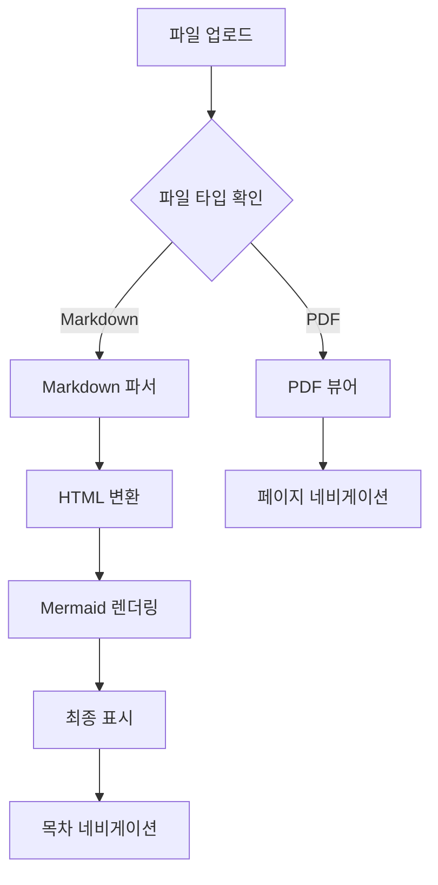
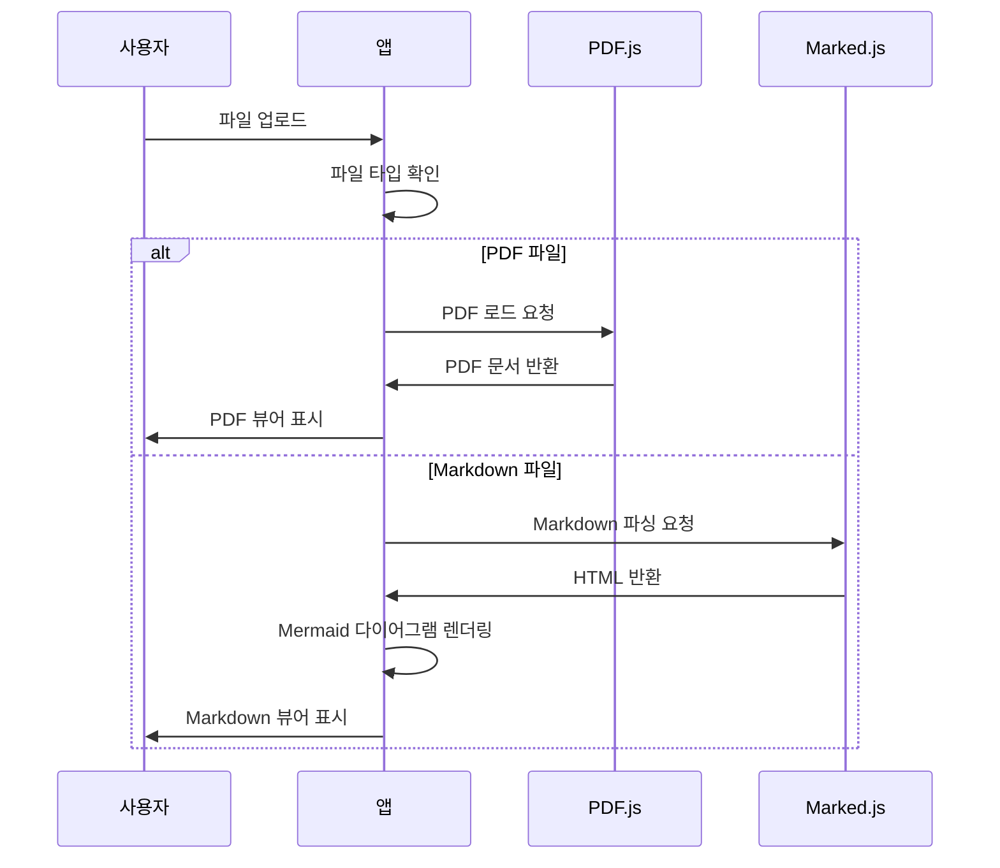
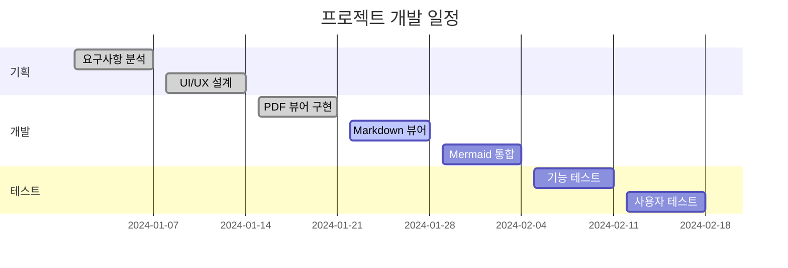

# 문서 뷰어 테스트

이 문서는 **문서 뷰어**의 Markdown 렌더링 기능을 테스트하기 위한 샘플 파일입니다.

## 기본 Markdown 기능

### 텍스트 스타일링

- **굵은 글씨**
- *기울임 글씨*
- `인라인 코드`
- ~~취소선~~

### 목록

#### 순서 없는 목록
- 첫 번째 항목
- 두 번째 항목
  - 중첩된 항목
  - 또 다른 중첩 항목
- 세 번째 항목

#### 순서 있는 목록
1. 첫 번째 단계
2. 두 번째 단계
3. 세 번째 단계

### 인용문

> 이것은 인용문입니다.
> 
> 여러 줄에 걸쳐 작성할 수 있습니다.

### 코드 블록

```javascript
function greet(name) {
    console.log(`안녕하세요, ${name}님!`);
}

greet('사용자');
```

```python
def fibonacci(n):
    if n <= 1:
        return n
    return fibonacci(n-1) + fibonacci(n-2)

print(fibonacci(10))
```

## 표 (Table)

| 기능 | 지원 여부 | 설명 |
|------|-----------|------|
| PDF 뷰어 | ✅ | PDF.js를 사용한 고품질 렌더링 |
| Markdown 뷰어 | ✅ | Marked.js를 사용한 HTML 변환 |
| Mermaid 다이어그램 | ✅ | 다양한 다이어그램 지원 |
| 코드 하이라이팅 | ✅ | Prism.js를 사용한 구문 강조 |

## Mermaid 다이어그램

### 플로우차트



### 시퀀스 다이어그램



### 간트 차트



## 링크와 이미지

### 링크
- [GitHub](https://github.com)
- [Markdown 가이드](https://www.markdownguide.org/)
- [Mermaid 문서](https://mermaid.js.org/)

### 수평선

---

## 추가 기능

### 체크리스트

- [x] PDF 뷰어 구현
- [x] Markdown 뷰어 구현
- [x] Mermaid 다이어그램 지원
- [x] 목차 자동 생성
- [ ] 다크 모드 지원
- [ ] 파일 다운로드 기능

### 수학 공식 (LaTeX)

인라인 수식: $E = mc^2$

블록 수식:
$$
\int_{-\infty}^{\infty} e^{-x^2} dx = \sqrt{\pi}
$$

## 결론

이 문서 뷰어는 다음과 같은 주요 기능을 제공합니다:

1. **다중 파일 형식 지원**: PDF와 Markdown 파일을 모두 지원
2. **풍부한 렌더링**: 코드 하이라이팅, 표, 다이어그램 등
3. **사용자 친화적 인터페이스**: 직관적인 네비게이션과 목차
4. **반응형 디자인**: 다양한 화면 크기에 최적화

앞으로도 더 많은 기능을 추가하여 더욱 완성도 높은 문서 뷰어로 발전시킬 예정입니다.
